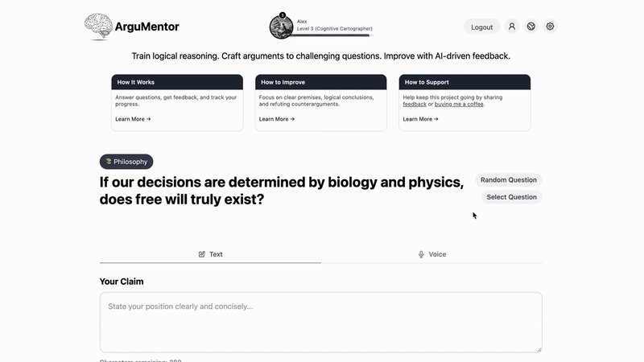

# ArguMentor

ArguMentor is a platform to train reasoning and decision-making skills. Users can construct arguments to challenging questions, improve with AI-driven feedback and track their progress.

<p align="center">
    
</p>

## Installation

### Option 1: Docker

```sh
docker compose build
docker compose up
```

Access the application at `http://localhost:8000`.

### Option 2: Python

Create and activate a virtual environment, for example via [uv](https://docs.astral.sh/uv/getting-started/installation/):

```sh
uv venv
source .venv/bin/activate
```

Install dependencies in editable mode:

```sh
uv pip install -e .
```

Install JavaScript dependencies:

```sh
npm install
```

Install PostGreSQL:

```sh
brew install postgresql
```

Create a database:

```sh
brew services start postgresql
psql -U postgres -c "CREATE DATABASE argumentor;"
```

Apply all existing db migrations:

```sh
flask db upgrade
```

Start app:

```sh
DEV=true USE_LLM_EVALUATOR=false python -m src.app
```

Start app with gunicorn (production setup):

```sh
gunicorn --bind localhost:8000 src.app:app
```

## Development

Install dev dependencies:

```sh
uv pip install -e ".[dev]"
```

Create a `.env` file from `.env_template` and specify values.

Install pre-commit hooks for auto-formatting:

```sh
pre-commit install
```

Run tests:

```sh
pytest tests/
```

Deploy to Google Cloud Run:

```sh
./scripts/deploy_cloudrun.sh
```

See [DEPLOY.md](DEPLOY.md) for one-time setup, secrets, Cloudflare configuration, and
cost guardrails.

Recreate db for local development:

```sh
flask recreate_db
```

Upgrading users:

```sh
flask list_users
flask upgrade_user
```

### Database Migrations

This project uses Flask-Migrate (and Alembic) to manage database schema changes. Follow these guidelines to keep your migration history clean and your environments in sync.

1. Update models.py

2. Generate a New Migration Script:

```bash
flask db migrate -m "Describe your changes here"
```

This will generate a migration script in the `migrations/versions/` directory. Always review it to ensure it reflects your intended changes.

3. Apply the migration:

```bash
flask db upgrade
```

4. Push changes and deploy

`scripts/deploy_cloudrun.sh` runs `flask db upgrade` as a Cloud Run Job before rolling
out the new revision. Unlike Heroku, Cloud Run has no release phase, so migrations are
an explicit step in the deploy script rather than something the `Procfile` handles.

### Scheduled Subscription Management

Expired subscriptions are downgraded to the free tier by a daily Cloud Scheduler job
that calls `/check-subscription-expirations`. See [DEPLOY.md](DEPLOY.md) for the setup
command.
